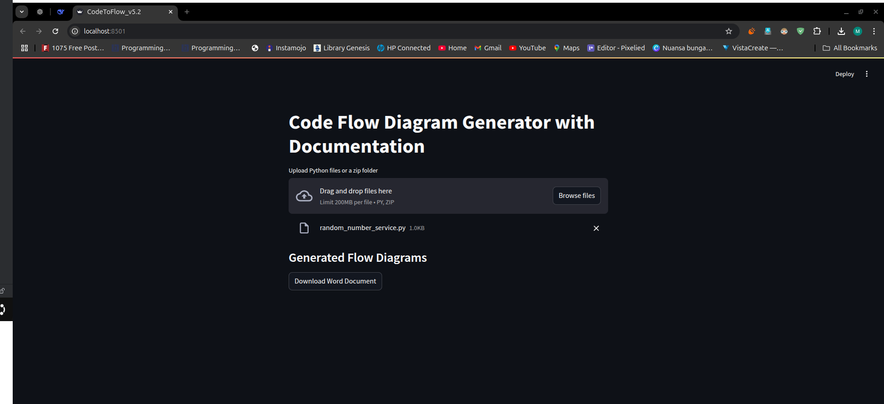
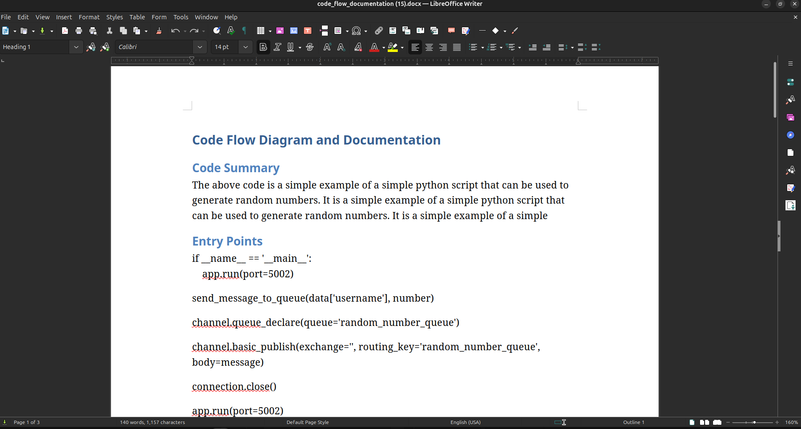
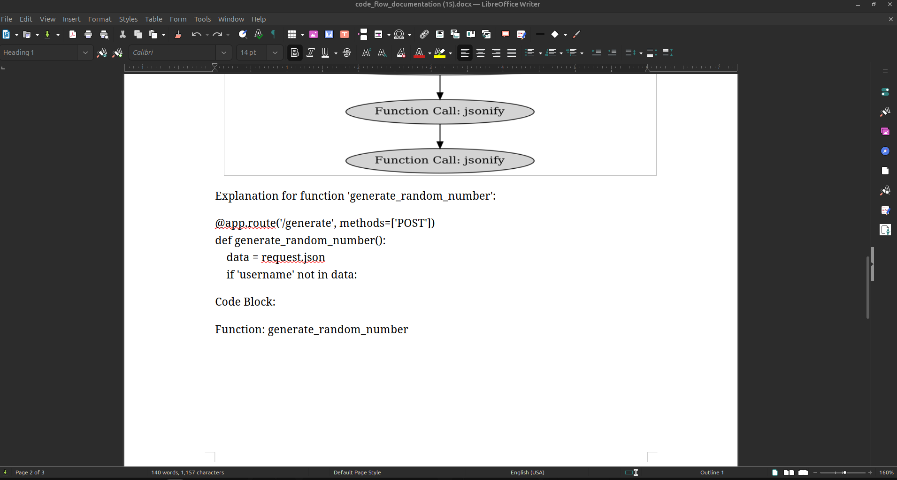
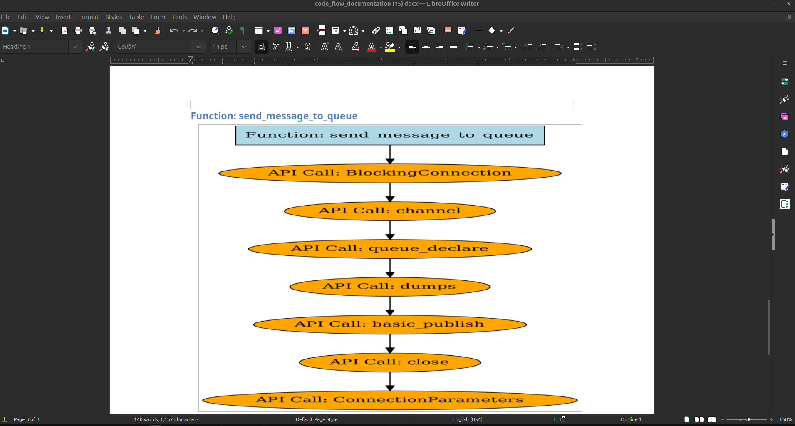

# Code To Software Documentation with Flow Diagram Generator

# Introduction
This project is an implementation of code to software documentation using the Hugging Face Transformers library to load the pre-trained model and generate software documentation for input code. The project includes a simple web interface that allows users to input code and generate software documentation using the model.

# Usage
The project is free to use without any cost. You can use it for your personal use or for your projects. You can also modify the code and use it for commercial purposes. You can also contribute to the project by adding new features or fixing bugs.

No API key is required to use this project. You can simply clone the repository and run the project on your local machine.

## We created this project to help developers generate software documentation from code. The project uses the Hugging Face Transformers library to load the pre-trained model and generate software documentation for input code. The project includes a simple web interface that allows users to input code and generate software documentation using the model.
## it is not so accurate but it can help you to generate a basic documentation for your code.
## we are continuously working on this project to make it more accurate and useful.

## you can use sample : SampleCodeFIle folder to test the project.

# Try Out on Streamlit
## [Open Application in Streamlit](https://codetodocument.streamlit.app/)

# Installation

To install the project, you need to have Python installed on your machine. You can download Python from the official website. Once you have Python installed, you can clone the repository and install the required dependencies using the following commands:

Requirements File:
```bash
pip install -r requirements.txt
```

# Running the Project

To run the project, you can use the following command:
```bash
streamlit run CodeToFlow_v5.2.py
```

## Note :  Use CodeToFlow_v5.2.py file becuse it has updated code.

# Images:









